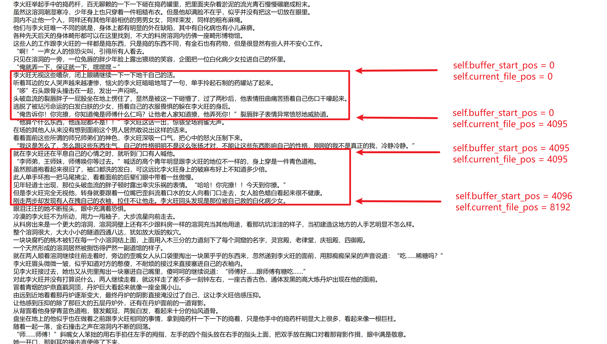

# iFish - 智能打字演示器

所需要的包：

```
ttkbootstrap
tk
pynput
python-dateutil
```

运行：

```
python main.py
```


## 后端类 —— typewriter

**设置状态：**

```python
    def __init__(self):
        self.file_handle = None     # 文件对象（未打开时为 None）
        self.buffer = ""            # 当前缓冲区内容    
        self.buffer_start_pos = 0   # 缓冲区在文件中的起始位置
        self.current_file_pos = 0   # 当前读取位置
        self.loaded = False         # 是否已加载文件
```


**开启文件函数 —— open_file**

```python
    def open_file(self, file_path, encoding):
        self.file_handle = open(file_path, "r", encoding=encoding, buffering=8192) # 设置缓冲区大小
        self.buffer = ""
        self.buffer_start_pos = 0
        self.current_file_pos = 0
        self.loaded = True
```

- self.file_handle = open(file_path, "r", encoding=encoding, buffering=8192)
  - 给open函数实例化，命名为file_handle 
  - 设置为只读
  - 缓冲区为8192
- 重置状态，并设置self.loaded = True


**输出字符函数 —— get_next_char**

```python
    def get_next_char(self):
        if self.file_handle is None:
            return None

        # 是否超出缓冲区范围
        if self.current_file_pos - self.buffer_start_pos >= len(self.buffer):
            chunk = self.file_handle.read(4096)
            if not chunk:
                self.close()
                return None
            self.buffer = chunk # 保存新缓冲区内容
            self.buffer_start_pos = self.current_file_pos # 更新缓冲区起始位置

        idx_in_buffer = self.current_file_pos - self.buffer_start_pos # 计算在缓冲区中的索引
        char = self.buffer[idx_in_buffer] # 弹出当前文字
        self.current_file_pos += 1  # 索引到下一个位置
        return char
```

- 缓冲区设置
  - 


**重置函数 —— reset**

```python
    def reset(self):
        if self.file_handle:
            self.file_handle.close()
            self.file_handle = None
        self.current_file_pos = 0
        self.loaded = False
```

- 重置状态


## 后端方法 —— utils（测试文件的编码）

```python
# 补丁
def detect_encoding(file_path): # 尝试检测文件编码
    encodings = ["utf-8", "gbk", "gb2312", "latin1"]
    for enc in encodings:
        try:
            with open(file_path, "r", encoding=enc) as f:
                f.read(1024) # 试读一点
            return enc
        except UnicodeDecodeError: # 报错继续
            continue
    return None
```

